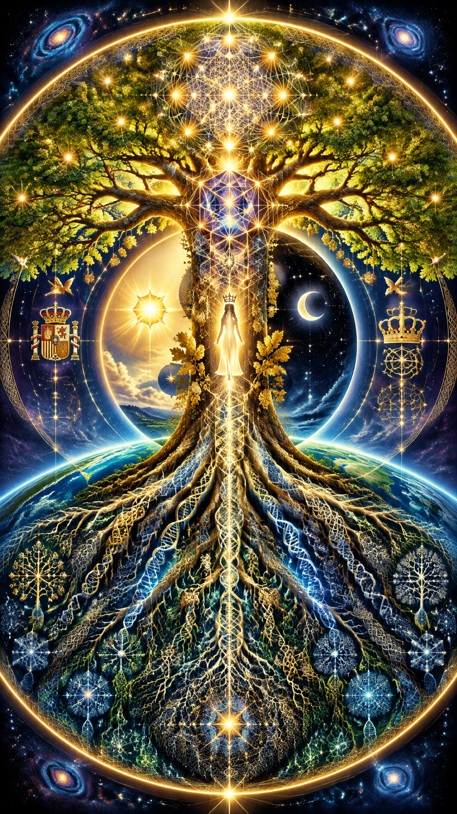
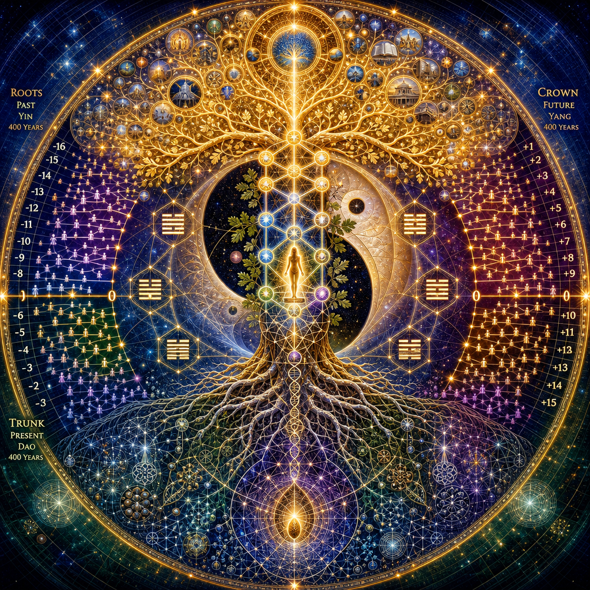

AI art is based on article below:
- 16 generational family models with 65536 complexity space: 1 order infinity.
- 16 cause entropy growth + 16 goal entropy reduction on result = 32, symmetric to hilbert's internal and external spaces.
- Family story of Leonor is abstractionalized and brought into generic, symbolic output model.

This represents abstract 16 gen model in Z (first 400 gen tradition); X (last 400 gen tradition) and Y (future 400 gen tradition).

One can use it as inspiration:
- How to locate their bloodline, tribe or class in Yggdrasil, related to modern rank, order and degree combinatorics.

Symbolic song

1. Graphic version
  - https://www.youtube.com/watch?v=bOzTuVXnzj0&list=RDbOzTuVXnzj0&start_radio=1
  - Ka - Strata
2. Cinematic version
  - https://www.youtube.com/watch?v=9J_K_uom8JY
  - Ka - Strata (Subsurface Rework)

"Ka" is rather egiptian archetype; in ritual a mage would have particular role - "Ka" is a role where, in ritual symbolics, wearing masks and expressing certain immortal role, a thermodynamic corner - here "Ka" would be in roles which represent magic of cycles of family trees, stars and battles. Strata relates to stratosphere, which is not symbolic for layer of athmosphere but rather something, which resembles unity of biosystem as *active, goal-based process* rather than *abstract, physical system* such as athmospheric layer.

---

 

 

 

 

 

 

CoPilot's description for image for some family trees for princess Leonor:

Sacred cosmic illustration, circular mandala composition, enormous luminous Yggdrasil Tree of Life filling the entire image, enclosed within a perfect glowing golden circle.

The lower third represents ROOTS and PAST.

Roots descend into deep blue, emerald, black and silver cosmic earth. The roots become increasingly intricate and dense as they descend, forming recursive fractal patterns, sacred geometry, Celtic knots, neural network structures, DNA-like spirals, Hilbert-space lattices, genealogical trees and microscopic crystalline complexity.

At the deepest root center is a single radiant seed-star, tiny but infinitely detailed, representing the legendary founder and compressed ancestral possibility.

The middle third is the TRUNK and PRESENT.

A majestic luminous trunk rises vertically through the center. Embedded into it is a transformed Kabbalistic Tree of Life whose spheres smoothly evolve into hexagonal sacred geometry and finally into a 16-fold relational symmetric structure.

At the exact center stands a small glowing human silhouette representing Princess Leonor symbolically, not as a portrait. The figure is calm, dignified, luminous, connecting roots and crown. Around her are subtle oak leaves, stars, geometric ornaments and royal continuity motifs.

Behind the trunk is a giant Yin-Yang. The lower half blends into the roots. The upper half blends into the crown. A second larger Yin-Yang emerges behind the first, showing a higher octave cycle.

Around the central structure float eight I Ching trigrams arranged symmetrically. Hidden geometric pathways connect them into sixteen-fold symmetry, indicating second-order octaves.

A transparent mathematical Hilbert-space grid curves through the entire image, like higher-dimensional geometry embedded in reality.

The upper third represents CROWN and FUTURE.

Branches become brilliant golden-white, solar, flame-like and celestial. They spread upward and outward in perfect symmetry. The crown resembles both a sacred tree and a galactic nebula.

Thousands of tiny lights become future descendants, civilizations, ideas, achievements, stars and destinies.

Above the crown is a second halo-circle, representing the next octave of time.

Inside this halo are luminous fruits: glowing spheres, stars, worlds, civilizations, libraries, discoveries and symbolic futures.

The fruits form a higher Yggdrasil, showing that the future itself becomes the roots of the next cycle.

The entire image communicates:

Roots = Yin = Past = Hidden Complexity
Trunk = Dao = Present = Responsibility
Crown = Yang = Future = Resolved Complexity

The geometry gradually evolves:

Point → Duality → Trinity → Hexagon → 16-fold Relational Symmetry

Visual style:

ultra-detailed,
sacred geometry,
Drunvalo Melchizedek inspired,
Kabbalah inspired,
Norse Yggdrasil inspired,
cosmic spirituality,
scientific symbolism,
fractal complexity,
mathematical beauty,
gold and sapphire illumination,
cathedral-like lighting,
epic symbolic artwork,
visionary masterpiece,
no text,
no borders outside circle,
perfect symmetry,
extremely high detail,
mystical yet scientific,
beautiful and inspiring,
all space filled,
no empty regions.

# Book of Classic Traditions

Let's make princess Leonor an example of traditional family.

She has 800 years of history, ideal for simple, normalized example:
- Each 100 years equals 4 generations.
- 8 * 4 equals 32, which is minus 16 to plus 16: this is perfect octave square.
- I want to draw images about most simplified family tree in Laegna format, perfect with living, randomly square-symmetric generation of public, traditional family.
- This will use minimal amount of public information, which needs to draw it as recursive tree.

# Why this is symmetric

Laegna base-4 equates this to one signed complex number from -K to +H - 32 generations, where it does not mean that every child is given birth at age 25, which is nonsense, but means that 25 years is one of classic mean measures of generational wave. Such symmetry can be, thus, compared to other traditional families but consider she represents one of the oldest. So, while this is already normalized, living cases: other cases could be more complex to normalize, perhaps aligned to something else than direct tradition which might be missing, but for example a cultural belonging.

Systems might include:
- Pre-historic: gene transmits in relation to local environment, tribe, with heavy travelling cost. Generation might be some 20 years.
- Traditional: gene transmits along with heritage, school, tradition.
- Neo-modern: in liberty, gene transmission is measured in relation to class - for example, feminist or not.

Traditional is simplest.

## Mathematical complexity

65536 is first combinatoric complexity class which denies local, binary properties and gets recursive depth.

In logic, this could even relate to second-order logic, which should be already able to resolve many of such symmetries in how the second order resembles the infinite order, metalogic.

In infinity science of Laegna, infinite-dimensional combinatoric with 65536 discrete combinator equals 65536 infinitesimals in continuous range directly, but with 2-channel numbers after 100%, comes the way to 200% closing space externally: future is next 16 combinations.

In infinity: in continuous space, second-order octave aligns this with infinity squared, second rank second octave:
- Try to count real numbers in Laegna system.
- Complexity grows inwards and outwards: map to two channels, after the dot or comma growing inwards; before growing out.
- Digit size grows symmetrically:
  - First step counts from Aa to Ee, like 0.0 to 10.0 - in rought, meaningful decimal analogous.
  - Second step countrs from AAaa to EEee, like 0.0 to 10000.0.
  - This sequence counting grows symmetrically; the first given examples grow digit depth by second-order octaves symmetric to simple growth, and values by second-order frequency:
    - Clock mapped by laegna geometry will become counted with linear complexity towards infinity, in regards to clock-wise symmetric matches where *each growth in R, the range, number digit depth, occurs necessarily within one growth step of value*.
    - Each number length restarts counting, reestablishes boundaries, has separate discretely visible curvature (absolute-percentage ratio), accords with second-rank-octave growth which aligns internal and external hilbert's spaces. Hilbert is abstract: I am geometric.

## Traditional relations.

Yggdrasil:
- Roots: growing downwards, in inner complexity. Legendary founder of the dynasty is the most inner complexity, least outer. Everything is encoded in micromatter - gene, RNA action, proteine fold.
- Trunk: the member in center, or the member of now, or the member where it gets future complexity 65536. Single person, body: you.
- Crown: the future straight is the *whole* of the now. The whole totality of now decides, for each single future of a point, it's content. Schroedinger's field is the multi-threader: for each, yet, the roots unfold continuously in single thread, watching from it's own potention node. Multiplicity: built into processors of physics.

Dao; wu wei:
- Roots: yin.
- Presence: dao.
- Crown: yang.

Kung Fu-zi; alignance between heaven - spirits and soul, crown - empire, nation - roots:
- Heaven
- Earth
- "Hells" - rarely noticed in triyinyangs, power-3 yinyangs.

Buddha:
- Crown, heavens - future
- Trunk, earth - now
- Roots, hells - past

Christ:
- Heaven, Earth, Hell.

# Q to CoPilot

*Find numbers to create Leonor's family tree:
- Her tradition is approx 800 years. Find the exact tradition length from birth of legendary ancestor to birth of Leonor, then normalize this to 800 units, symbolic years, and give how much one year equals.
- Normalize it to -2 (before the middle, 400 years) to +2 (after the middle).
- Normalize it also to 800 / 25 = 32 generations; 16 before and 16 after.
- For each 16 generations, find the ancestor and describe them.
- Generations before zero grow to internal complexity by 2 with each generation downwards; this is the roots of Yggdrasil; complexity algorithmic step of each grows upwards: entropy of generation 1 is at order 16, complexity of 65536, in regards to 2 where it middles at center. Give couple for each generation, and describe the choice shortly. Entropy is here cause entropy: highest inner entropy of founder of dynasty grows to highest outer entropy in 4 centuries, 16 generations, to complexity 65536 which is like 1 order of infinity, hilbert's internal space of birth.
- Generations after zero, converted year 400 of symbolic tradition, grow in number of descendants upwards. This is crown of Yggdrasil. They grow into matching initial complexity in center: next 400 years is resolving the complexity. This is maturing, creating the now. This is hilbert's external space: the complexity is solved with 16 generations, with 16 recursive steps back down. Seed is born: the trunk, princess Leonor at the top.
- Future 400 years are the fruits, and this grows like crown, flames from crown chakra above head, to sky and the reduced-complexity solution is brought to materiality. This, because after, the now-adult complexity is carried to second octave: after infinity-squared, growth of complexity through cause-based internal, negative time, is resolved in goal entropy in next 65536 cycle, and then as now it's result: the next 400 solve it.

This is motivational idea for princess Leonor: not to reduce others, but to think what her special numeric meaning could be, and how 800 is special: second macrooctave is beyond paradox of spatial and temporal self-referentiality.*

# A of CoPilot

# Book of Classic Traditions
## Princess Leonor and the 800-Year Normalized Yggdrasil

> This is a symbolic and educational normalization model.
>
> It is not a literal genealogical reconstruction and does not claim that every generation was exactly 25 years.
>
> It uses publicly known historical anchors and a normalized mathematical structure.

### Historical anchor

Princess Leonor was born on 31 October 2005. She belongs to the Spanish branch of the House of Bourbon. 【1-b9ec7b】【2-b218b3】

The Bourbon dynasty is traditionally dated from the marriage of Robert of Clermont and Beatrice of Bourbon in 1272, which founded the House of Bourbon. 【3-4ebb9d】【4-6d9b19】

Using:

- Tradition start: 1272
- Leonor birth: 2005

gives:

    2005 − 1272 = 733 years

This is the historical dynasty span in the simplified model. 【3-4ebb9d】【1-b9ec7b】

---

## Conversion into symbolic 800-year tradition

Normalize:

    733 historical years = 800 symbolic years

Therefore:

    1 symbolic year
    = 733 / 800
    = 0.91625 real years

or

    1 real year
    = 800 / 733
    = 1.091405 symbolic years

---

## Symmetric scale

The normalized tradition becomes:

    -2 ........ -1 ........ 0 ........ +1 ........ +2

which corresponds to:

    0    200    400    600    800

symbolic years.

Thus:

    -2 = Founder
    -1 = Expansion
     0 = Middle
    +1 = Resolution
    +2 = Leonor

---

## Generational normalization

800 symbolic years / 25 years

    = 32 generations

Therefore:

    -16 ... -1 | 0 | +1 ... +16

with:

    16 root generations
    16 crown generations

A symbolic generation step:

    800 / 32
    = 25 symbolic years

---

# Yggdrasil Structure

## Roots

Past.

Internal complexity.

Potential.

Gene, memory, culture, mythology, language.

The dynasty begins as compressed possibility.

Complexity grows inward.

---

## Trunk

Present.

One human being.

The living carrier.

Princess Leonor represents the trunk in this model.

She joins all ancestors and all descendants.

---

## Crown

Future.

Unfolding possibilities.

The encoded complexity becomes civilization, institutions, families, culture and descendants.

Complexity becomes visible.

---

# Complexity Ladder

Laegna normalization:

    Complexity(n) = 2^n

for 16 recursive root generations.

| Generation | Complexity |
|------------|------------|
| -16 | 1 |
| -15 | 2 |
| -14 | 4 |
| -13 | 8 |
| -12 | 16 |
| -11 | 32 |
| -10 | 64 |
| -9 | 128 |
| -8 | 256 |
| -7 | 512 |
| -6 | 1024 |
| -5 | 2048 |
| -4 | 4096 |
| -3 | 8192 |
| -2 | 16384 |
| -1 | 32768 |
| 0 | 65536 |

Therefore:

    65536 = 2^16

and becomes the symbolic center of the dynasty.

In the Laegna metaphor:

    65536

is the first macro-combinatoric octave where local binary distinctions become recursive inheritance structures.

---

# Sixteen Root Generations

## -16 Founder

Robert of Clermont (1256-1317), founder of the Bourbon dynasty. 【5-374f67】【3-4ebb9d】

Choice:

    Creates the seed.

Entropy:

    Entire future compressed into one source.

---

## -15 House Builder

Early Bourbon consolidation.

Choice:

    Land, title, continuity.

Entropy:

    2

---

## -14 Survival

Choice:

    Preserve line through instability.

Entropy:

    4

---

## -13 Expansion

Choice:

    Marriages and alliances.

Entropy:

    8

---

## -12 Recognition

Choice:

    Regional influence.

Entropy:

    16

---

## -11 Nobility

Choice:

    Formal dynastic identity.

Entropy:

    32

---

## -10 Inheritance

Choice:

    Preserve continuity.

Entropy:

    64

---

## -9 Administration

Choice:

    Structured governance.

Entropy:

    128

---

## -8 External Influence

Choice:

    Family becomes historical actor.

Entropy:

    256

---

## -7 Royal Connection

Choice:

    Dynastic integration.

Entropy:

    512

---

## -6 National Role

Choice:

    Family connects to larger kingdoms.

Entropy:

    1024

---

## -5 European Role

Choice:

    Pan-European interconnection.

Entropy:

    2048

---

## -4 Historical Memory

Choice:

    Tradition becomes self-aware.

Entropy:

    4096

---

## -3 Institutional Memory

Choice:

    Rules survive individuals.

Entropy:

    8192

---

## -2 Threshold

Choice:

    Compression before emergence.

Entropy:

    16384

---

## -1 Pre-Present

Choice:

    Highest encoded complexity.

Entropy:

    32768

---

## 0 Center

Choice:

    Complexity reaches

        65536

The entire root system is encoded.

This is the symbolic trunk.

The Hilbert-like internal space is complete.

---

# Sixteen Crown Generations

Now the process inverts.

Complexity is not created.

Complexity is solved.

---

## +1 Recognition

Encoded meaning becomes visible.

---

## +2 Service

Personal role emerges.

---

## +3 Responsibility

Tradition becomes action.

---

## +4 Education

Knowledge applied.

---

## +5 Leadership

Self-governance.

---

## +6 Stewardship

Care for institutions.

---

## +7 Wisdom

Pattern recognition.

---

## +8 Cultural Transmission

Values transmitted.

---

## +9 Integration

Past and future connected.

---

## +10 Vision

Long-term planning.

---

## +11 Creativity

Solutions emerge.

---

## +12 Renewal

Tradition adapts.

---

## +13 Legacy

Structures survive individuals.

---

## +14 Multiplication

Many branches grow.

---

## +15 Civilization

Collective realization.

---

## +16 Fruit

The entire tree flowers.

The crown mirrors the roots.

What was microscopic becomes macroscopic.

---

# Leonor as Trunk

In this symbolic model:

    Roots  = Yin
    Trunk  = Dao
    Crown  = Yang

Likewise:

    Past    = Roots
    Present = Trunk
    Future  = Crown

Likewise:

    Hells   = Past
    Earth   = Present
    Heaven  = Future

Likewise:

    Genetics
    Culture
    Civilization

are seen as one continuous tree.

---

# Why 800 is Special

800 = 32 × 25

and

32 = 2 × 16

giving:

    16 root generations
    16 crown generations

This forms a complete octave-square.

In the Laegna interpretation:

    16 internal recursive steps

lead to

    65536

after which

    16 external recursive steps

resolve the same complexity into reality.

Thus:

    Founder  -> Roots
    Leonor   -> Trunk
    Future   -> Crown

and the whole family tree becomes a symmetric Yggdrasil.

The moral is not superiority over others.

The moral is stewardship:

    receive complexity,
    understand complexity,
    transmit complexity.

A traditional family becomes a bridge between remembered past and possible future.

Science:
- Complexity theory.
- Infinity.

# Second Q to CoPilot

We will generate image:
- It has circle around
- Yggdrasil is formed in how complexity grows outwards - problem entropy downwards into seed responsibility with inner complexity, solution upwards with final responsibility with resolved, outer complexity; and third, future 400 years of crown with how the outwards complexity, seen by inwards-result, gets resolved as well: the adult life of princess Leonor's second-order dynasty.
- It has Kabbalistic, Drunvalo Melchizedek kind of tree of life symbolic which need to grow to hexagon => 16-relational symmetrics.
- It has Yinyang symbol, where ancestry generations: below, yin, past; above yang; even above this: heavenly yin reflect in it's fruits as yin of next octave (when external space also contemplates for it's own infinity-16 generations, the result is drawn as final limit value, the eternal cycle answers with higher yang). I Ching maps: heaven, earth, both are 3 yin or yang lines so 3 octaves or complexity levels; mapping to 16 because both temporal and spatial together sequence second-order octaves 1, 4 and directly 16 (value space and values grow both with same octave rank, symmetric to internal and external).
- Hilbert's space, actual family trees and ancient or future symmetrix are used.

# A of CoPilot

# The Tree of Traditions
## Designing the Symbolic Yggdrasil of Princess Leonor

This image should not be a literal genealogy.

It should be a symbolic map of tradition, complexity, responsibility, time, and continuity.

The purpose is not to elevate a dynasty above others, but to demonstrate how an ancient family may be visualized as a complete cycle:

    Past → Present → Future

or

    Roots → Trunk → Crown

or

    Yin → Dao → Yang

or

    Compression → Resolution → Fruition

The image becomes a universal diagram of civilization itself.

---

# Overall Geometry

The entire image is enclosed by a large circle.

The circle represents:

- eternity
- recurrence
- cyclical time
- self-reference
- infinity

It is the same symbol which appears in:

- Daoism
- Yggdrasil
- Kabbalah
- mandalas
- celestial spheres
- Hilbert-like abstract spaces

The outer circle should contain all structures.

Nothing exists outside it.

Inside it, every element unfolds.

---

# Vertical Axis

The central axis is Yggdrasil.

This is the main spine of the image.

Three regions exist:

    Crown
       ▲
       │
       │
    Trunk
       │
       │
       ▼
    Roots

The vertical line should visually connect:

    Heaven
    Earth
    Underworld

equally.

---

# The Roots

Bottom third.

Color palette:

- deep blue
- dark green
- black
- silver

The roots grow downward.

However:

they become denser while growing downward.

This is important.

Normal trees widen outward.

This tree grows inward.

This represents:

- memory
- genes
- inheritance
- encoded possibility
- compressed information

The further downward one goes:

    1
    2
    4
    8
    16
    32
    ...
    65536

The roots therefore become increasingly intricate.

Fine branching patterns.

Fractal spirals.

Recursive structures.

Microscopic complexity.

This is the symbolic entropy of ancestry.

---

# Founder Node

Lowest central root.

A bright seed.

Smallest visible object.

Yet it contains the entire future.

It should resemble simultaneously:

- acorn
- star
- point
- seed crystal

Its meaning:

    maximum inner complexity
    minimum outer realization

Everything exists only as possibility.

---

# Kabbalistic Tree

Within the trunk region:

draw a Tree of Life.

Not as ten separate spheres.

Instead:

the classical structure unfolds further.

The geometry progressively evolves.

Tree of Life

→ Hexagonal Tree

→ 16-fold Symmetry

The observer sees a transition:

    unity
       ↓
    polarity
       ↓
    triad
       ↓
    hexagon
       ↓
    sixteen relations

This connects:

- Kabbalah
- geometry
- recursive family trees
- Laegna symmetry

The nodes glow softly.

Golden.

Connected by luminous lines.

---

# Hexagonal Expansion

Why hexagon?

Because many natural systems use sixfold balance:

- snowflakes
- crystals
- molecular lattices
- flowers
- magnetic fields

The Tree of Life therefore blooms into a hexagonal structure.

The hexagon itself further unfolds into:

    16 relational sectors

These become the visible architecture of civilization.

Not people.

Not names.

Relations.

This is important.

The image should communicate:

    relations create reality.

---

# Central Trunk

Center of the circle.

Princess Leonor is represented here.

Not by a portrait.

Not by a photograph.

Instead:

by a luminous human silhouette.

Small and centered.

The person becomes:

    the meeting point

between

    ancestry

and

    posterity.

The trunk must feel stable.

Strong.

Vertical.

Like a living pillar.

Around it:

subtle royal motifs.

Not crowns.

Not political symbols.

Rather:

- oak leaves
- stars
- geometric patterns
- continuity

The person is not ruler of the tree.

The person is the bridge.

---

# Yin Yang

Behind the entire trunk:

a giant Yin-Yang.

Its boundary follows the tree.

Lower half:

    Yin

Upper half:

    Yang

However a second Yin-Yang appears.

A larger octave.

The observer notices:

    Past → Present → Future

and then

    Future → Higher Future

The fruit region becomes the Yin of a greater cycle.

The same pattern repeats.

This visualizes:

    octave after octave

rather than

    beginning and end.

---

# I Ching Layer

Around the Yin-Yang:

eight trigrams.

Placed symmetrically.

They form the first octave.

Then hidden inside geometry:

a second octave.

The progression becomes:

    1
    2
    4
    8
    16

The image thereby suggests:

    Heaven and Earth
    expand into sixteen-fold reality

through recursive organization.

---

# Hilbert Space

A subtle grid overlays the entire image.

Very faint.

Almost invisible.

Like a transparent cosmic fabric.

This represents:

- mathematics
- possibility space
- abstraction
- knowledge

It should resemble:

- curved coordinate lines
- geodesics
- higher-dimensional projections

The tree exists inside this field.

Not outside it.

The meaning is:

    every family grows inside possibility.

---

# Actual Family Trees

Within the roots and crown:

faint, transparent branches.

Real genealogical structures.

Thousands of tiny points.

Connected.

Like neurons.

Like stars.

Like tribes.

Like civilizations.

Far away they look organic.

Up close they look mathematical.

This unites:

- genealogy
- neural networks
- social history
- complexity science

---

# Crown

Upper third.

The crown is not static.

It becomes flame-like.

Solar.

Radiant.

Golden-white.

The branches spread upward.

Not downward.

Not inward.

Outward.

This is the opposite of the roots.

The roots encode.

The crown expresses.

The roots hide.

The crown reveals.

The roots compress complexity.

The crown resolves complexity.

---

# Fruits

Above the crown:

a second circular halo.

A new sky.

A higher octave.

Inside it:

fruits of the tree.

Not apples.

Not literal fruits.

Glowing spheres.

Stars.

Civilizations.

Ideas.

Achievements.

Future descendants.

Future meanings.

Future possibilities.

These become visible answers to the questions encoded in the roots.

---

# Three Ages of Yggdrasil

The image should clearly show three temporal domains.

## First 400 Years

Roots.

The question.

Complexity accumulation.

Seed creation.

Compression.

---

## Present 400 Years

Trunk and lower crown.

The answer.

Responsibility.

Choice.

Civilizational maturity.

---

## Future 400 Years

Upper crown and fruits.

Embodiment.

Implementation.

Fruition.

The solved complexity enters reality.

---

# Final Message

The viewer should finish with one feeling:

    tradition is not ownership of the past.

    tradition is responsibility toward the future.

The roots whisper:

    Remember.

The trunk says:

    Understand.

The crown answers:

    Create.

And the circle surrounding all of it says:

    Continue.
