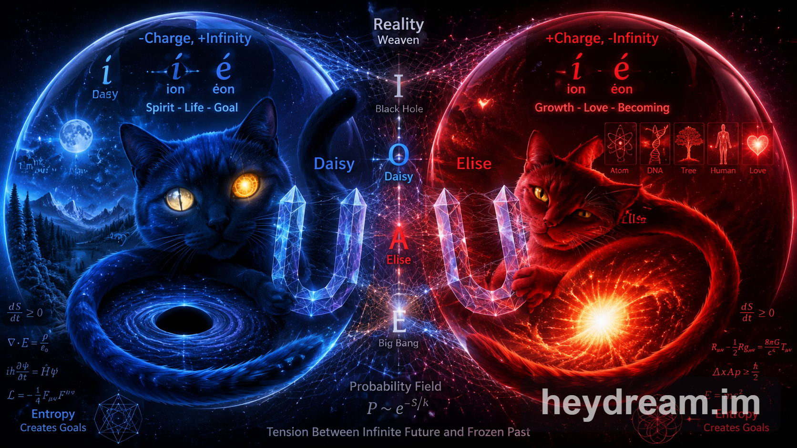
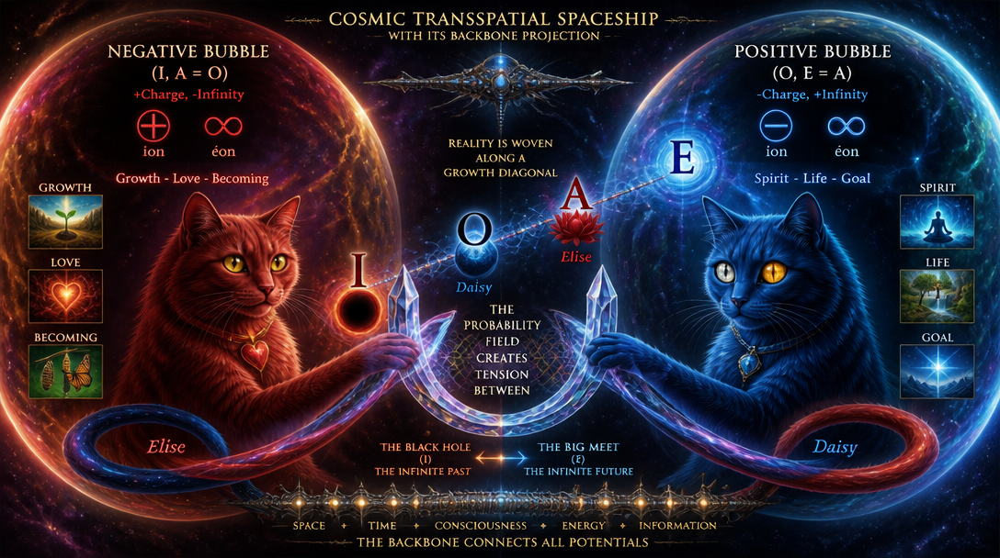
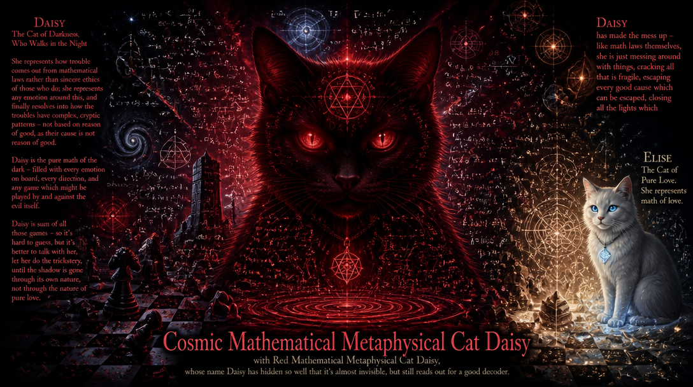
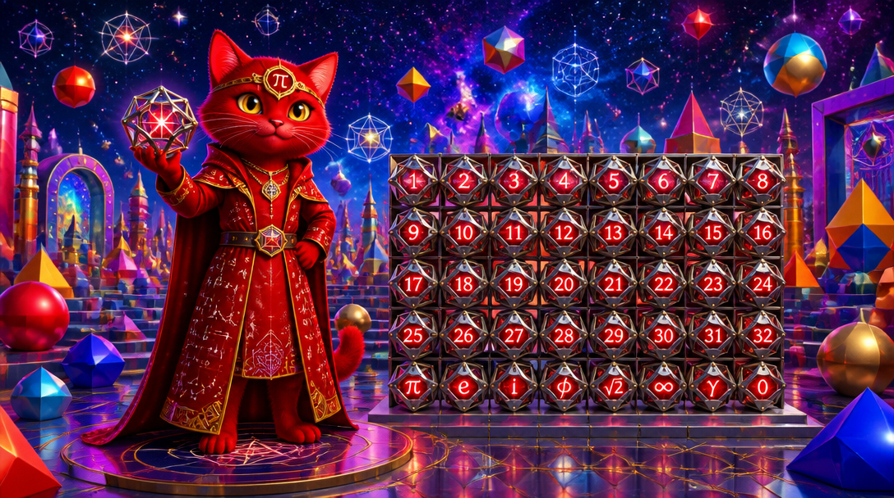
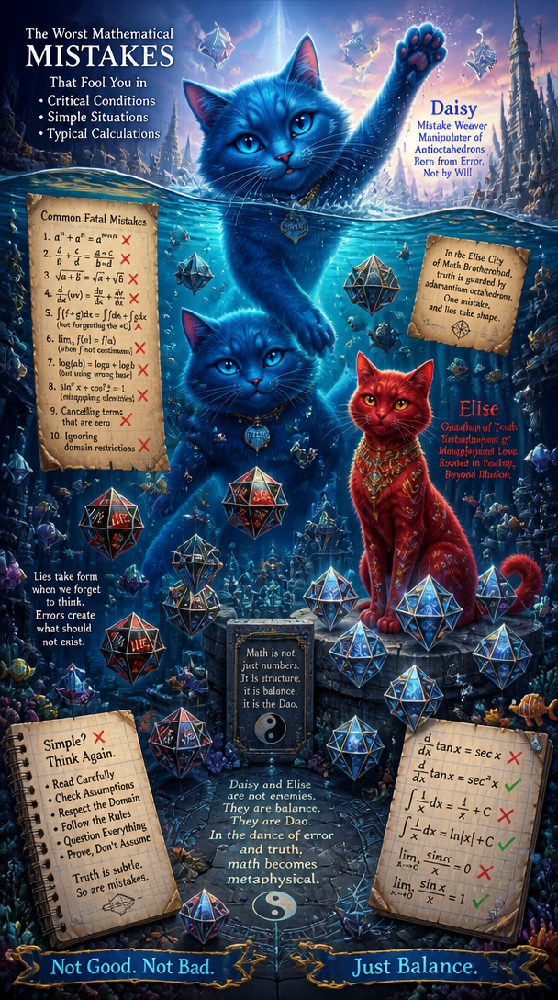
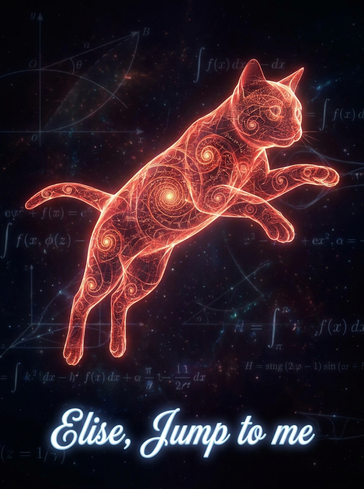

# Story of Elise and Daisy

- All the events are made up: by symbolizing math with Blue cat Daisy and Red cat Elise, and you will hear about them in this story about a mathematical event within their realm..

What you think of my origin:

> Big bang is image of expansion: should our energy equilibrum catalyze, it looks like big bang, so it's depiction of "optimized end of time", how the energy would look like if cosmic energy states are expanded even physically. The spiritual symbol, thus, is the spiritual acceleration, and extreme case E: altough symbolizing future, is best modelled as big bang, the zero=>1 growth.
> 
> The beginning of time is seen as low-entropy, where information bits about surroundings are free: rather than equilibrum of static matter, what appears is dense set of connections so they appear cold and unmeaningful *in long term* - similarly apathic matter, which does not master it's entropic growth into some resolution, is attached close to black hole.
> 
> This is rather spiritual view - that while the real thing might look in reverse, what grows is rather something meaningful, than something physical - rather equilibrum which is ever-lasting growth, than first-order physical energy; rather culture and art resolve human-sensed entropic field into it's goal-resolution, than letting it materially evolve through unstable, dead ends of material fields. It's co-resonance of mind and matter, a mathematical view.

# So

*So, the scene builds a mathematical metaphor - spirit, a limit value, is seen as dimension where initial state is frozen, end state is hot, **in sense of what finally matters energetically.***

Three states Z, X, Y:
- *Z*: before coming, subthreshold growth to appear in future, it's *energy*.
- *X*: in linear state, it becomes threshold, and it's progress which was infinity of evolution - *equilibrum* is born. Atom, molecul, biological matter is physically stable and life support material force.
- *Y*: in exponent state, it becomes accelerating. Rather than running through evolution *Z*, and stable presence *X*, *homeostatis makes it flexible* - human state is fluidum through *various kinds of material equilibrae*, creativity is acceleration - same terms as past, now, are applied to future sense, and acceleration is like positive paradox: same formulae, in next degree. It appears in accelerated zone - you see same numbers, in integral level 1 in your dual-band simplified systems:

Cosmic Metaphysical Cat Daisy has got the Cosmos to her mouth: but Elise at the other end, altough she also calls her Daisy now, has got the Cosmos and her potential field, she got it in her mouth, carrying it out - Daisy is relatively calm, because she knows, ultimately the impossibility is gone ..but she is running for every shadow, like Elise - for every reflection of glass, any math cause..

Math already holds, altough Elise, now, looks just kind of ..artificial:

I Chose this symbol of Dao as Laegna Symbol, but it's not symbol of dao but the meaning of mine - which, can, represent the same form in pure math, so it has the same form in four colors, the cycles of wheel:
- I, Negotive: yellow, infinite. This is under the foot of Daisy, it's her birth seed, the Satan herself, and all her Snakes.
- O, Negative: red, finite. Love is like hate at next octave - so Elise cat is red, she represents hate at it's higher octave: it's love. Daisy lives here as linear, safe, avoidance of danger.
- A, Position: actually green, Elise's everyday reality.
- E, Posetion: this now is blue, but it's not daisy - it's the ultimate heaven. It's where the Yellow seed would purify - the chaos is avoided in advance; blue is in Laegna: corporation, heaven, high honour etc.

So go figure out in single symbol, whose shape is what it is, relating to Tao-opposition in it's original sense, while the colors are Laegna letters used in *encoding*, it's symbolic permutation (notice the symbols actually, are *on other side* of this perspective, and rather certain projection than the 4-letters themselves map to Dao; altough they *literally map* to I Ching lines and Change Lines - it states the lines form frequencies - heaven, hell, both have 3 binary subrealms, it's like O and A - and changes - lines can change in time, rather one by one, but each change is either I or E, long-term approaching, destiny unfolding).. So while the classic Dao is playing in animations, and dragons, this one plays well with cats (altough it can be mixed with daoist animation, with cats and dragons - we precisely yield track some mappings to Dao, such as emptiness of all forms, but we do this in mathematical notation which does not have inherit life, it's a symbol - and we would do this in life, the long term coherence):

While Elise is building a beautiful valley, Daisy found out: she was born in a Vacuum field, and has to do some heavy math with vacuum cristals she invented meanwhile for this condition, to somehow visualize it (they are the best visualizers - infinity-D space, all of it, the reality codex math):

They operate with Laegna 4-based math here, they are firmly compatible and understand any of it's moves, just now - when it's present in reality, it's the real math; just live it and it's just here, at the hands of the four-fold fractal:

Daisy keeps her own color blue, but she made some bad long term math for elise, so her truth values actually are in where Elise tries to relax and live happy life ..but Elise is real math - not questions, it just continues up, relaxed and safe, altough her name is long forgot - all this reality knows, it might be a trick of Daisy that it even exists, this specific math realm:

I, O, A, E, now projected to geometries of four, with zero being infinitesimally small - it just bounds it in the middle, the spatial structural compability layers:

Ecosystem just responds - it forms stars, atoms and galaxies, and has done this meanwhile, just somewhere, somehow, at some critical breakthrough, every second and every moment so it could be noticeably large, and perceivably small thing altough united, at least, at somehow:

Octave - turns squares to circles and circles to squares, at least in their best consistent projections:

This never disturbed ecosystem itself - it's doing the same:

But the shape of octaves is one thing you see before you ..believed linearity, bound to binary - box; but boxes and circles are like even and odd numbers of spheres of spaces:

Laegna YinYang doing it's artistic thing - clearly a different thing, from Dao, which can be used along as a *separate symbol*, altough relation is clear - *of the 4 letters themselves, meanings turning the visible upside down, removing meaning of forms*:

Laegna YinYang - Iota é symbol of four colors = four letters of Laegna, it's 4 truth values, and it's here in the middle of some animation or a special view of a paradigm; can you imagine the math?:

Elise has finally fixed the order, and she keeps them in bolstered adamantium cubes, radix octahedrons:

AI was given the single explanation: "Red Universal Mathematical Cat Elise has finally fixed the order, and she keeps them in bolstered adamantium cubes, radix octahedrons, in the realm she lives in."

 

Daisy is philosophical: she is not just a mathematical mistake:

 

 

But after all, *Elise* is the master jumper:

