This is imaginary gallery of times and scopes and spaces, holographic views of what can be present: fractal math art.

 

# Symmetries and Scales - an introduction

 

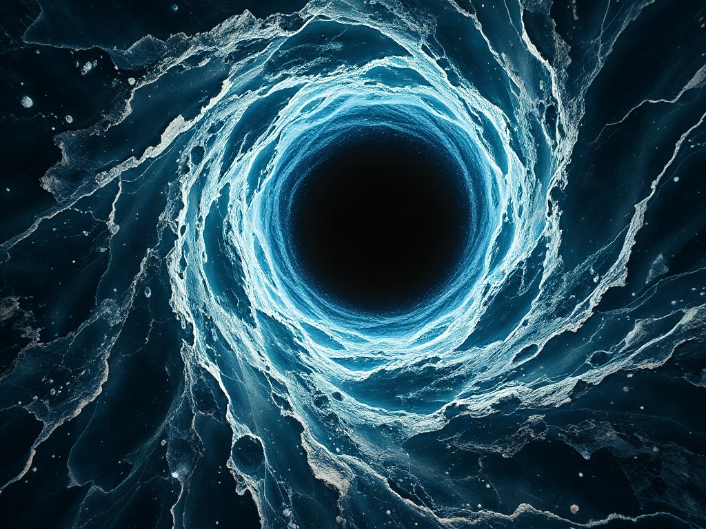

 

# A Future Woman

 

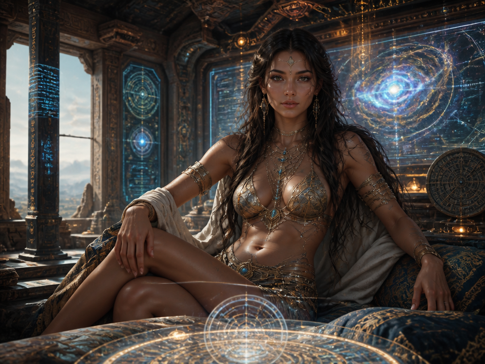

 

# Random Objects

 

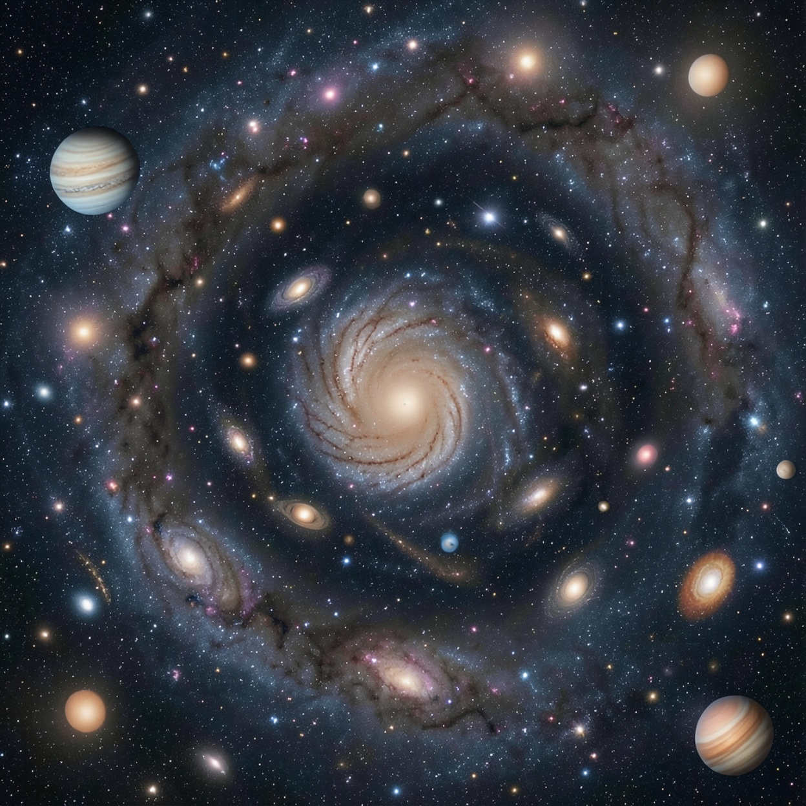

 

# Infinitely Many

 

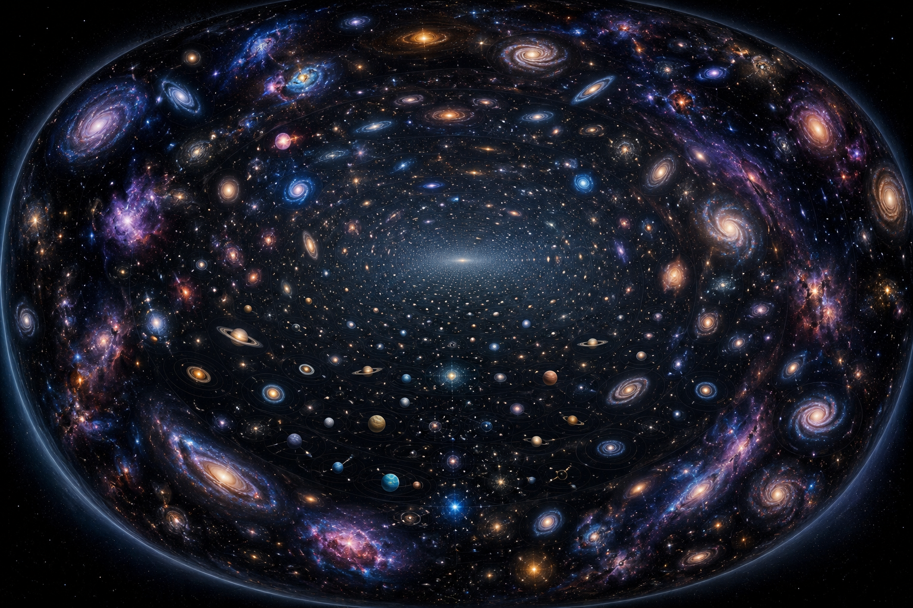

 

# Magic Ball

 

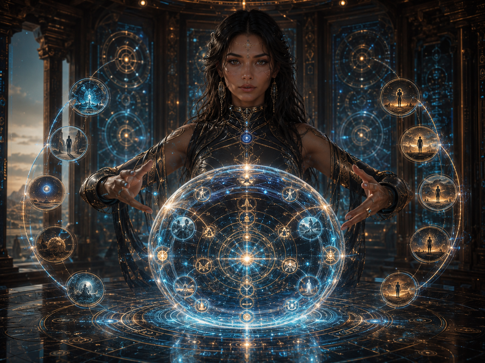

 

# Magic Web

 

 

# Hologram Projective Room

 

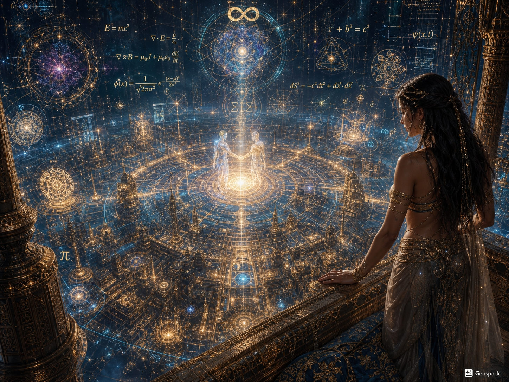

 

# Ball Octaves

 

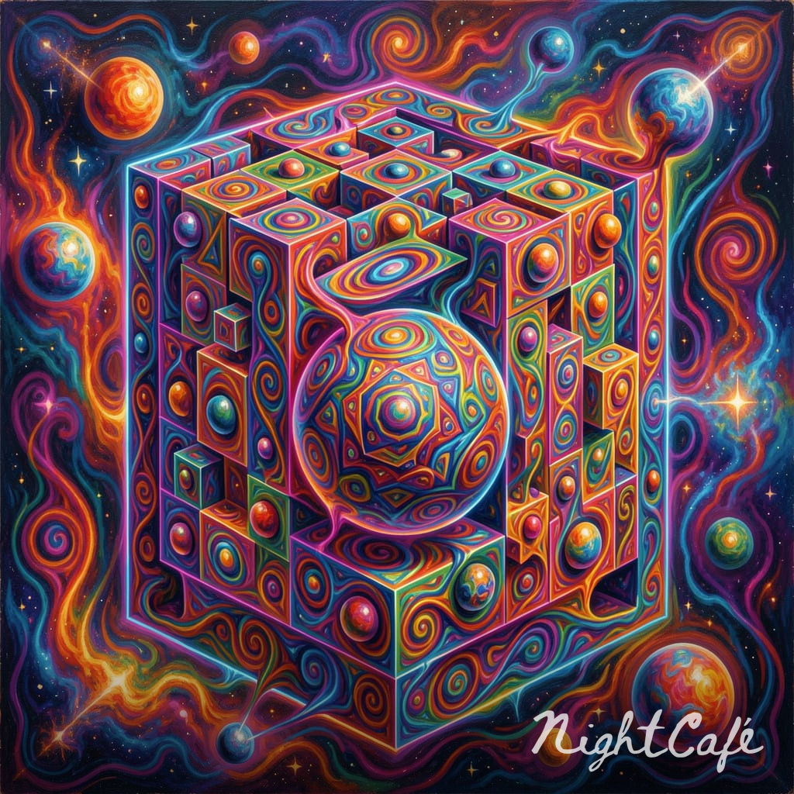

 

# Times and Places

 

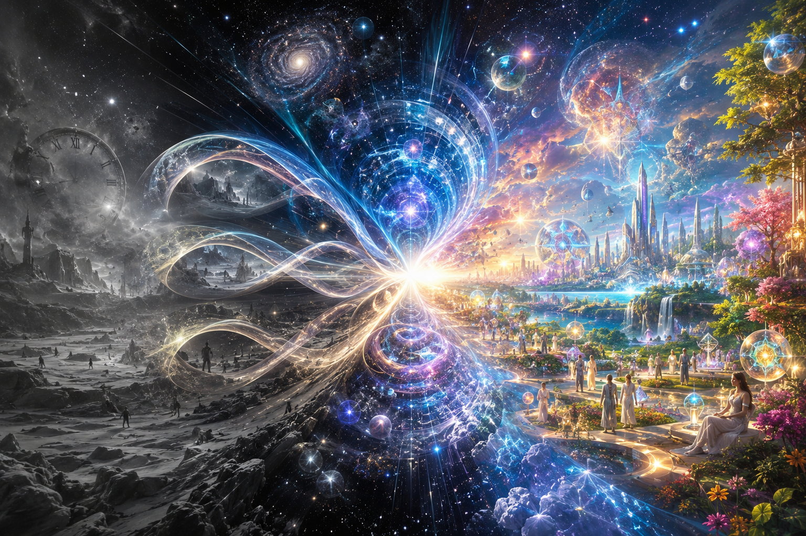

 

# Cube Octaves

 

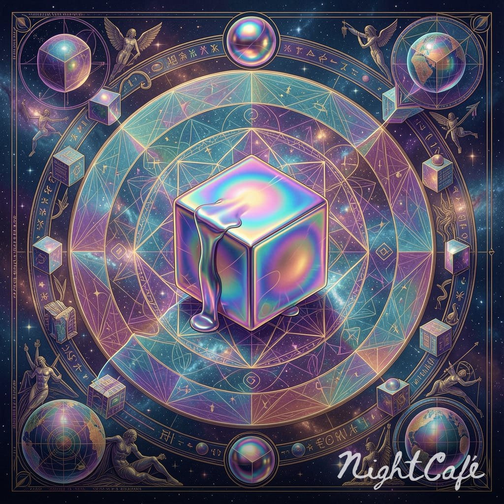

 

# Magic Garden 1

 

 

# Magic Garden 2

 

 

# Life Skies

 

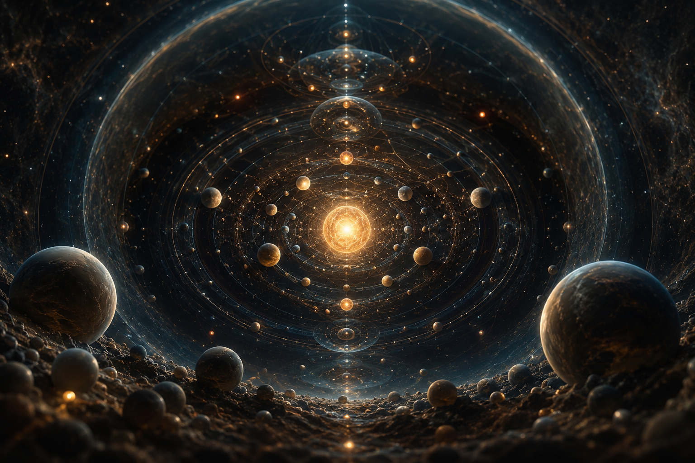

 

# Dance in the Future

 

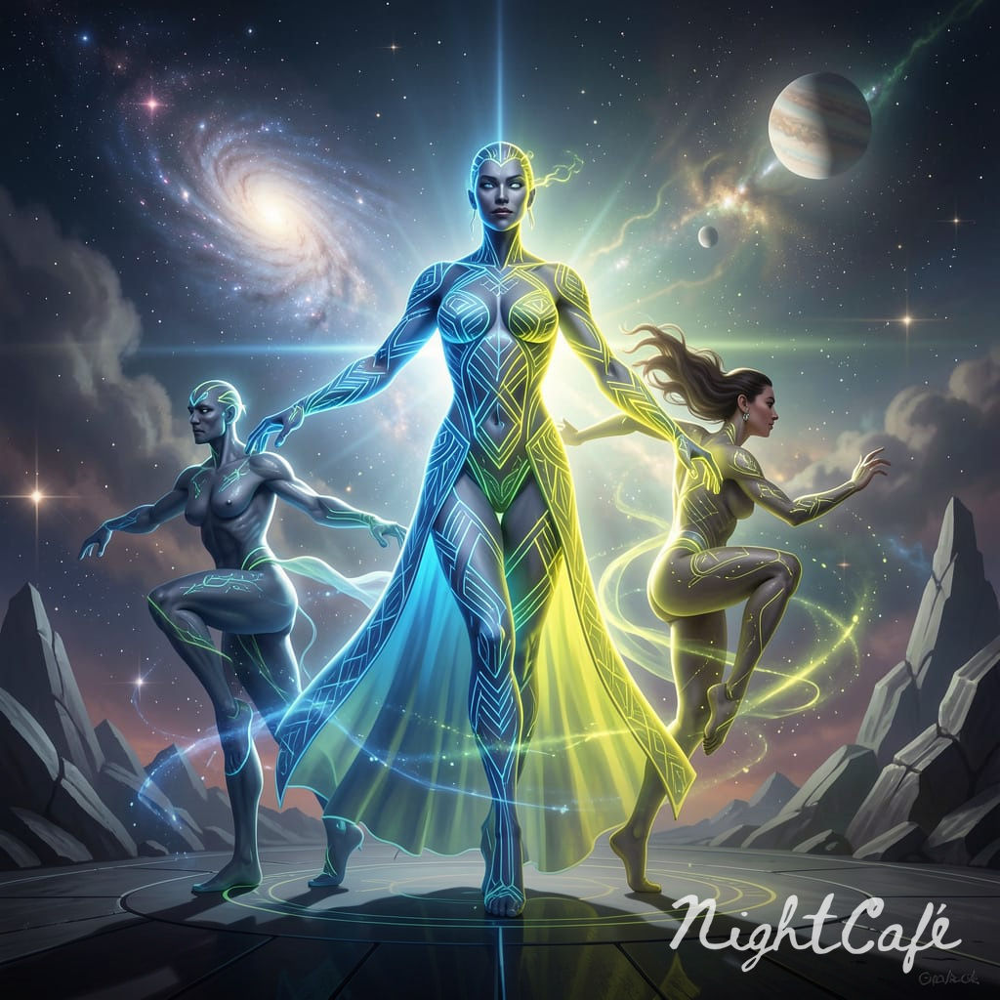
