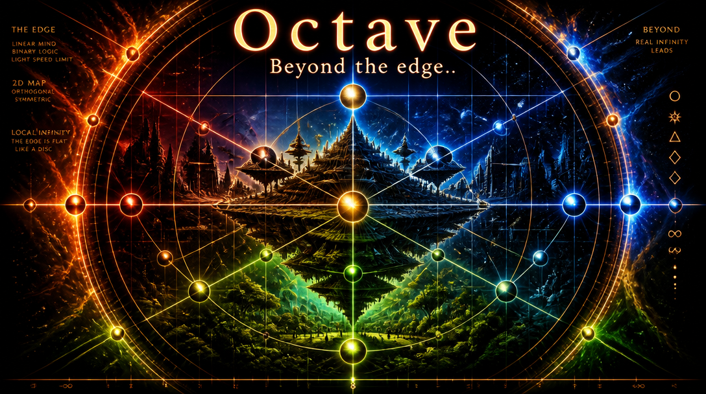
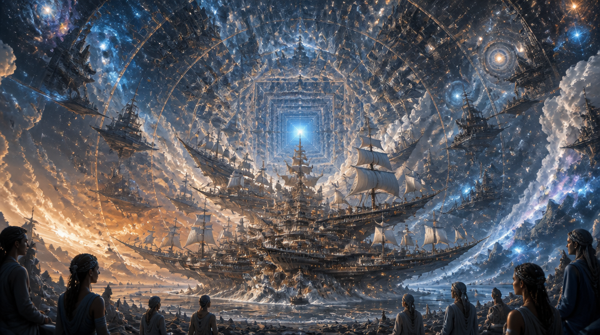
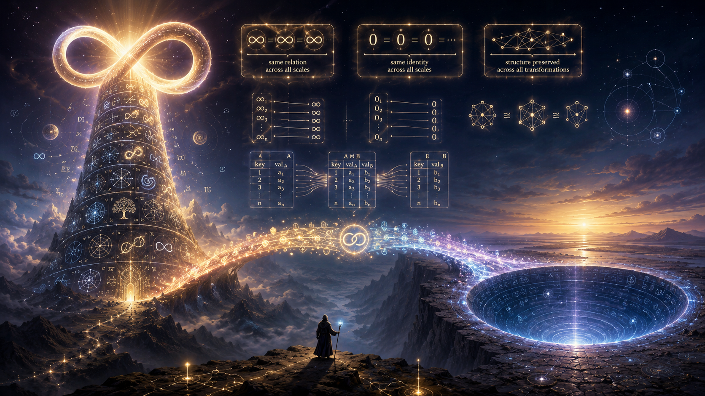
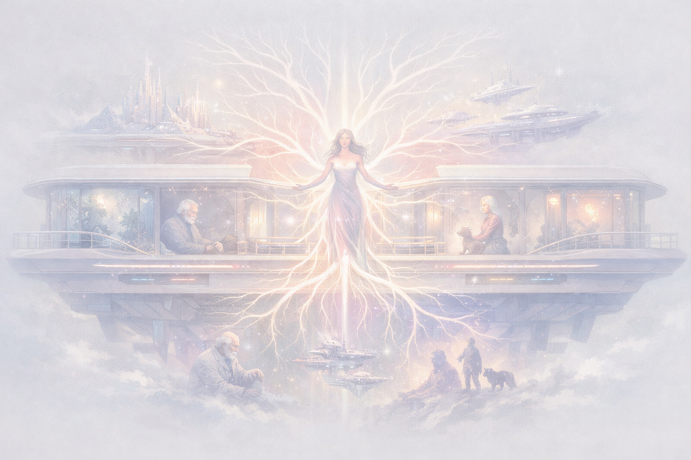
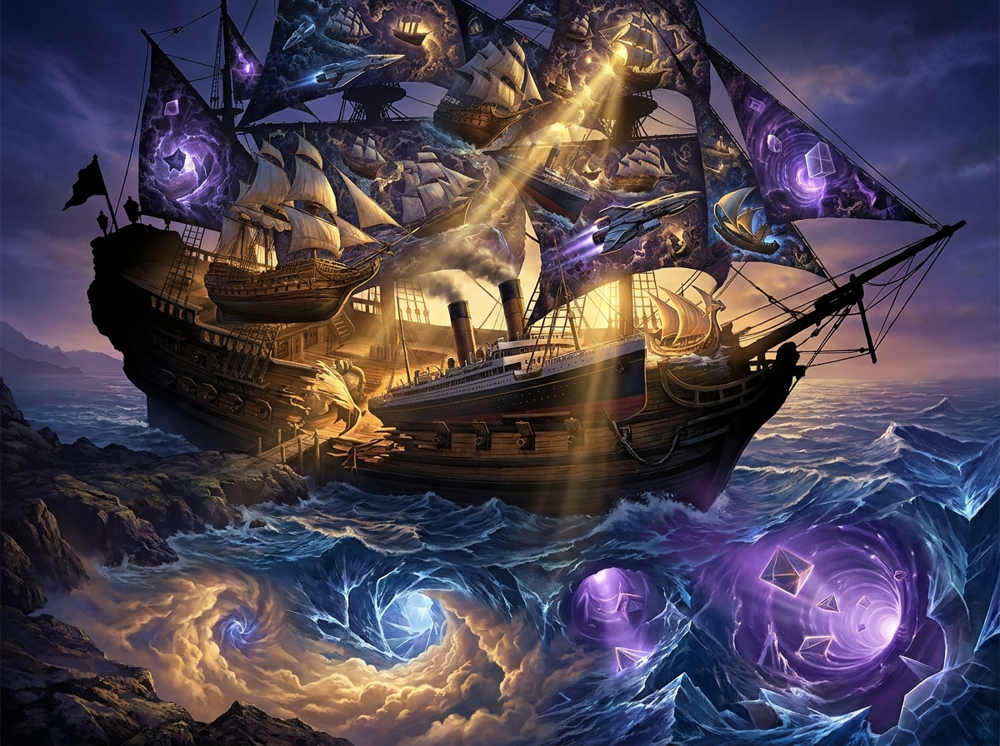
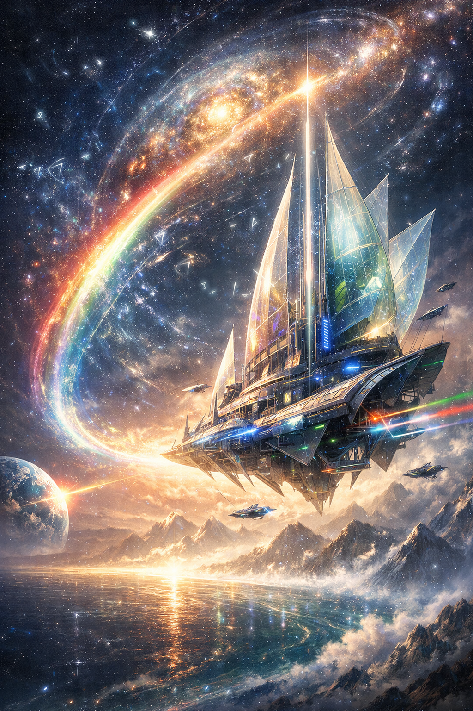

Here, some images of Laegna ferry, cosmic ship:
- It appears as many small ships for each life form if they are watched from close, each navigating their small direction.
- When looking from far, it appears like one big ship, navigating to integral direction of all those small ones - of all life and matter.

## Laegna Ferry & Fractal Infinity Ship — Image Gallery

### Entry & Concept Origins
**Beyond the Octave Is Octave**  

**Ferry Infinity Entry**  

### Core Infinity Ferry Forms
**Infinity Ferry**  

**Infinity World**  

### Laegna Ferry Variants
**Laegna Ferry (Classic)**  

**Laegna Ferry Variant 1**  

**Laegna Ferry Variant 2**  

**Laegna Ferry Watercolor**  

### Crystal & Landscape Interpretations
**Laegna Ship in Crystal Space**  

**Laegna Ship Landscape**  

**Laegna Ship Portrait**  

### Z‑Space Reference
**Z‑Space from SpiReason Atlas**  

